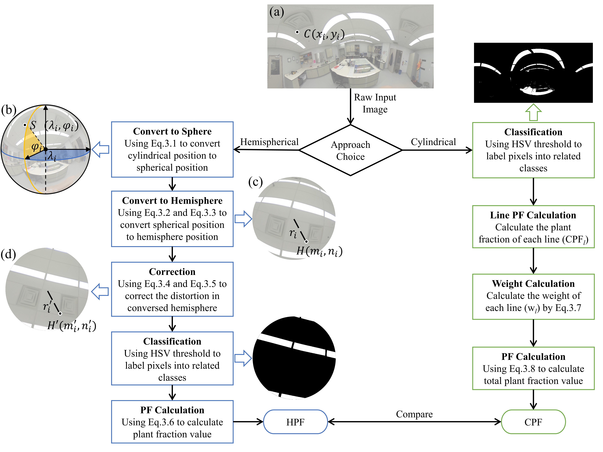
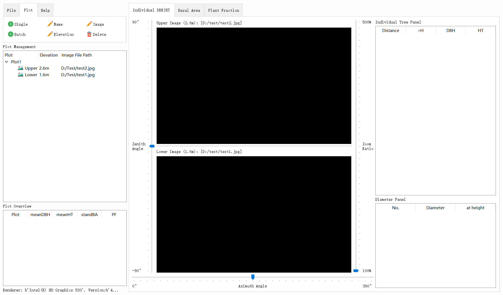

# Spherical2TreeAttributes

This is the graduation project for the Master of Science in Forestry in UNB. It uses the spherical camera (Rioch Theta S) to estimate forest attributes under canopy. This project has three parts:

1. Estimating **Stand Basal Area** from spherical images.
2. Estimating **Canopy Structural Fractions** (plant, sky, foliage, etc.) from spherical images
3. Estimating **Individual tree Attributes** (DBH, Height, spatial location) from two spherical image pairs.


## 1. Stand Basal Area (Chapter 2)

See this project: https://github.com/HowcanoeWang/Panorama2BasalArea

## 2. Canopy Structure Fractions (Chapter 3)



> The workflow of two approaches to estimate plant fraction
> (PF) from spherical photos. The left blue workflow is the hemispherical
> approach (HPF) which converts original cylindrical images to hemispherical
> images first then apply algorithms commonly used in hemispherical images. The right
> green one is the cylindrical approach (CPF) which directly calculate the PF
> value on original cylindrical images without image converting.

See `Plant Fraction` Folders，the item goes:

```python
Plant Fraction/
|- config.py   # The HSV theshold and path settings
|- Hemispherical/   # Hemispheical Approach in Thesis Chapter 3
|   |- Conversed_57.5/   # The output folder for generated fisheye images.
|	|- converse.py   # Convert Raw image to Fisheye image with distortion calibrated
|	|- classify_all_fisheye.py   # The model for HSV classification
|   |- plant_fraction_hemi.py   # Operate HSV classification for all fisheye images.
|- Cylindrical/
	|- plant_fraction_cyli.py   # The model for HSV classification for raw image
    |- classify_all_cylindircal   # Operate HSV classification for all images
```

## 3. Individual Tree Attributes

The GUI to mark key points (base and top of tree) in spherical image pairs. However, limited by schedule, the database hasn't been developed, all the calculating data needs to be pasted to the Excel file (`DataTemplate.xlsx`)


Operation Steps:

1. Run app.py scripts.
2. Load spherical images (`OpenImg` button) at 1.6m and 2.6m for left panel and right panel respectively.
3. Mark ground control points (click once on each image, e.g. plot center)
4. Press (`Convert`) in **1.6m img**, and paste result to the first column in `Plot ` Sheet
5. Press (`Convert`) in **2.6m img**, and paste result to the next column in `Plot ` Sheet
6. Press `N` to start marking a new tree.
7. Following this order to mark key points:
   1. **1.6m img** tree **base**
   2. **2.6m img** tree The model for HSV classification
   3. (the horizonal red line will be locked at 1.3m)
   4. **left** point of DBH at **1.6m img**
   5. *right* point of DBH at **1.6m img**
   6. **left** point of DBH at **2.6m img**
   7. *right* point of DBH at **2.6m img**
   8. **1.6m img** tree top
   9. **2.6m img** tree base
   10. Paste result to a row of `Tree` Sheet
   11. repeat previous steps for all trees in this spherical image pair
8. Reload next plot images.

## 4. Integrated App

Future work: Integrate all the previous functions into one app.




---

icon url:

<div>Icons made by <a href="https://www.freepik.com/" title="Freepik">Freepik</a> from <a href="https://www.flaticon.com/" 			    title="Flaticon">www.flaticon.com</a> is licensed by <a href="http://creativecommons.org/licenses/by/3.0/" 			    title="Creative Commons BY 3.0" target="_blank">CC 3.0 BY</a></div>